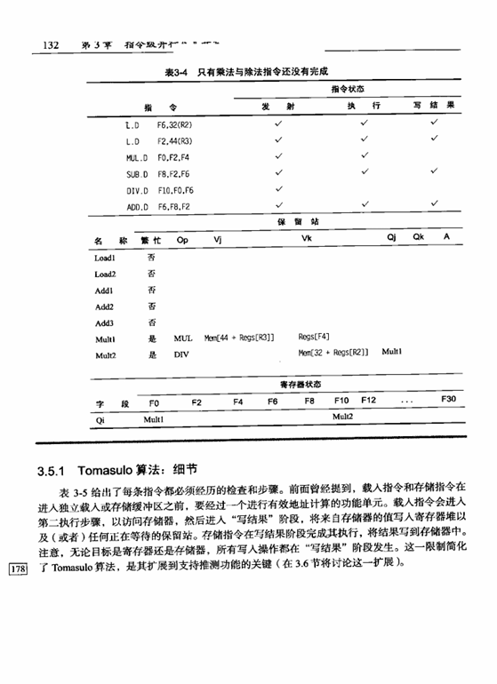
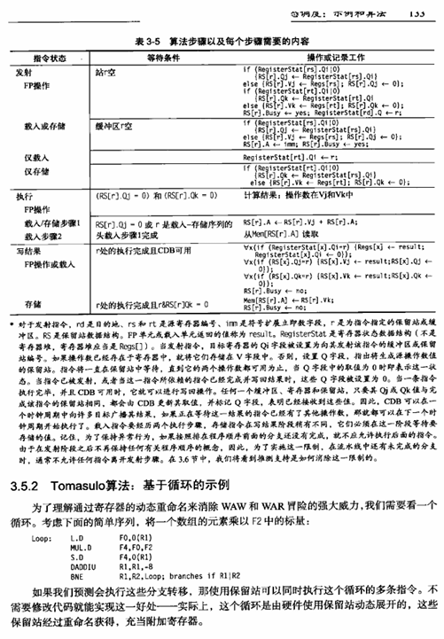
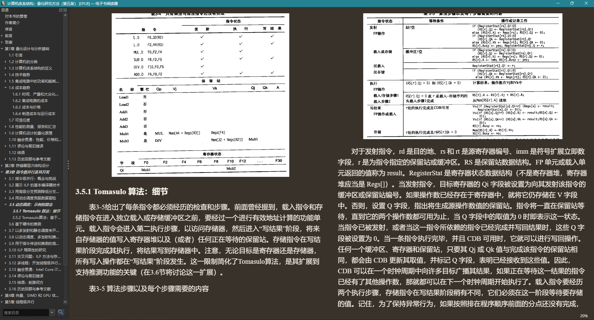

<div align="center">


# pdf2epub

将 PDF（含扫描版）转换为 EPUB。
**脚本负责机械性工作，内容判断与转写交给 LLM。**

解析引擎：[PaddleOCR-VL](https://github.com/PaddlePaddle/PaddleOCR)（云API令牌在百度 [AI Studio](https://aistudio.baidu.com/account/apikey) 获取，每日两万页免费）。

</div>

## 背景

PDF 的版式为纸面印刷而设计，在小屏幕电纸书（6~7 英寸墨水屏）上阅读体验较差：
字号偏小、版面拥挤、无法随阅读器设置重排；大屏设备虽可阅读，但便携性不足。
EPUB 作为重排格式，更适合小屏阅读设备。因此一条自然的路径是：
**使用 OCR 模型识别 PDF，由 LLM 校准识别结果，再转换为 EPUB。**

本项目是这条链路的完整实现。其中"识别 → 校准 → 转写 → 校验"的流程不绑定目标格式，
其他"将 PDF 转换为其他格式"的需求同样适用。

## 实际效果

以《计算机体系结构：量化研究方法（第五版）》612 页扫描版为例：原书为整页扫描图像、
无文本层，包含大量跨页表格与公式。前两图为原书扫描页，下图为同一内容转换后在
阅读器中的效果（全书分 31 片解析，成品通过 EPUBCheck 校验，0 错误）：

<p align="center">
  
  &nbsp;
  
  <br/>
  
</p>

说明：EPUB 中**部分表格以图片形式呈现**，这是有意的设计——对于难以可靠识别的表格
（列数多、结构错位、单元格含公式），要求 LLM 不强行转换为 HTML，而是直接从原书
截取图像插入，以保证内容不失真；其余表格仍保留为可搜索、可重排的普通表格。

## 快速开始

推荐的使用方式是**将仓库提供给 AI Agent**，由其按照
[docs/agent-guide.md](docs/agent-guide.md) 执行。以下是基本流程：

```bash
pip install -e ".[render]"       # render 提供页面渲染，建议安装
export PADDLE_TOKEN=...          # 或写入 .env

pdf2epub doctor                  # 环境自检
pdf2epub init book.pdf
pdf2epub run
```

`run` 不会一次性执行完毕：流程推进到需要内容判断的环节时会**暂停并输出工单**
（退出码 3），按照工单完成相应工作后重新执行 `run`，直至退出码为 0：

```text
pdf2epub run    # → 3  停在校准阶段：对照 pages/*.png 修正解析错误
pdf2epub run    # → 3  停在撰写阶段：编写 build/book.json 与 OEBPS/text/*.xhtml
pdf2epub run    # → 0  打包并通过 EPUBCheck，产物输出至 output/<name>.epub
```

已完成的阶段不会重复执行；未通过的阶段会重新生成工单。

### 退出码

| 码 | 含义 |
| --- | --- |
| 0 | 成功，产物通过校验 |
| 1 | 失败，详见 `pdf2epub alerts` |
| 2 | 执行完毕但存在告警（包括"已接受不合格产物"） |
| 3 | **等待 LLM 处理**，按工单完成后重新执行 `run` |

## 工作方式

| 阶段 | 执行者 | 产出 |
| --- | --- | --- |
| `prepare` | 脚本 | 切分 PDF → PaddleOCR-VL 解析 → 产物归一化 + 交界处校验 |
| `calibrate` | **LLM** | 对照页面图校准解析结果，直接编辑 `calibrate/source.md` |
| `compose` | **LLM** | 直接编写 `build/book.json` 与 `build/OEBPS/text/*.xhtml` |
| `check` | 脚本 | 生成 OPF/nav/container → 打包 → 自检 + EPUBCheck → 报告 |

设计动机：无论解析后端能力多强，总存在没有把握的段落（形近字、串列、公式符号）。
判断这些内容是否正确需要查看原始页面、理解上下文，这属于 LLM 的工作。
因此本项目**没有**引入 Markdown→XHTML 转换器、章节切分启发式、元数据推断或
确定性修复引擎；脚本只保证三件事：搬运准确、定位精确、**不将不合格产物静默标记为成功**。

各关卡的具体操作方式与已知问题：**[docs/agent-guide.md](docs/agent-guide.md)**（必读）。

## 配置

配置优先级：`内置默认 < .env < pdf2epub.toml < 环境变量 < 命令行`。

- 解析服务 Token 写入 `.env`：`PADDLE_TOKEN=...`
- 其余选项见 [`pdf2epub.toml`](pdf2epub.toml) 内注释，可通过 `PDF2EPUB__SECTION__KEY`
  形式的环境变量覆盖

## 环境要求

- Python 3.10+；PaddleOCR Token（在 AI Studio 创建）
- 页面渲染依赖 `pypdfium2` + `Pillow`（即 `[render]` extra；未安装时将退化为
  纯文本校准并产生告警）
- EPUBCheck（依赖 Java）：将 jar 解压至 `tools/` 目录即可被自动发现，或通过
  `EPUBCHECK_JAR` 指定路径；未安装时仍可运行，但仅保留自检并明确告警

`pdf2epub doctor` 可逐项检查上述依赖。

## 开发

```bash
pip install -e ".[render,dev]"
pytest        # 基于伪造解析产物跑通全链路，无需联网与 Token
```

常用命令：`init / run / done / show / status / list / alerts / doctor / clean`，
加 `--json` 获取机器可读输出。
